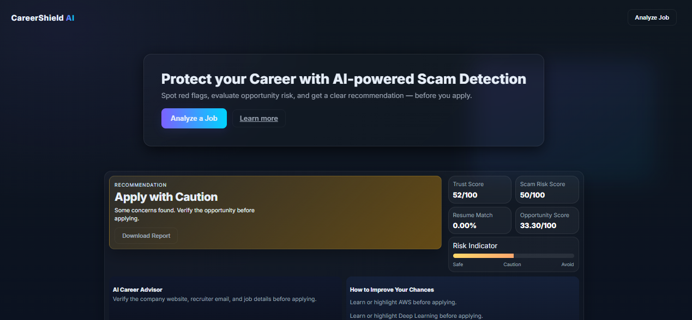
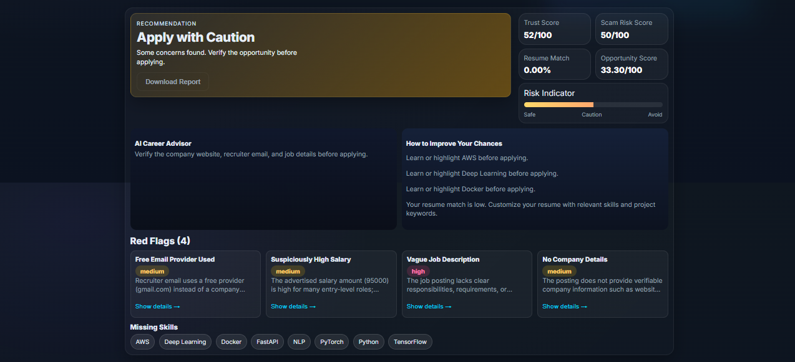
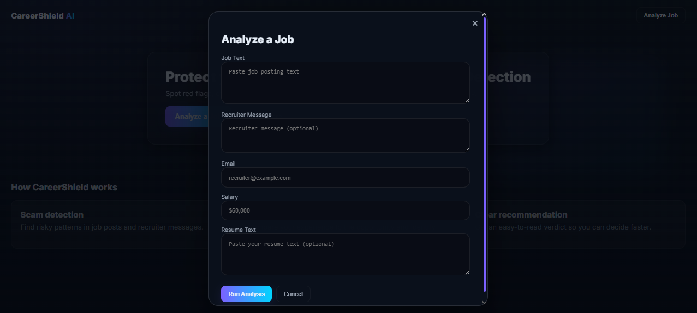
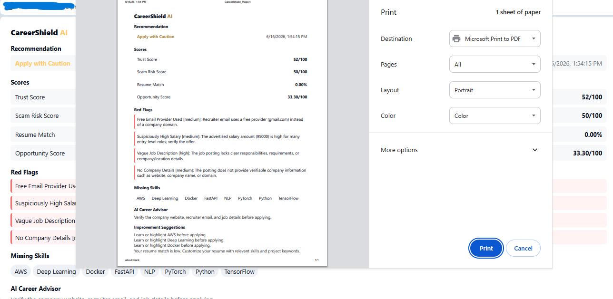

# 🛡️ CareerShield AI

### AI-Powered Scam Job Detection & Opportunity Analysis Platform



> **Before you apply. Before you share your resume. Before you pay a single rupee.**
>
> CareerShield AI helps job seekers identify recruitment scams, evaluate job opportunities, analyze recruiter credibility, and understand resume-job alignment before making career decisions.

---

## 🚨 The Problem

Every year, thousands of students and fresh graduates fall victim to:

* Fake internships
* Registration fee scams
* Upfront payment frauds
* Fake recruiter emails
* Work-from-home scam offers
* Unrealistic salary promises

Most candidates have no reliable way to verify whether an opportunity is genuine.

**CareerShield AI was built to solve exactly this problem.**

---

## ✨ What CareerShield AI Does

Provide:

✅ Recruiter Message

✅ Recruiter Email

✅ Salary Information

✅ Resume Content

And CareerShield AI instantly generates:

### 📊 Opportunity Intelligence

| Metric             | Description                      |
| ------------------ | -------------------------------- |
| Trust Score        | Measures opportunity credibility |
| Scam Risk Score    | Indicates fraud likelihood       |
| Resume Match Score | Measures candidate-job alignment |
| Opportunity Score  | Overall opportunity quality      |

---

### 🚩 Scam Detection

Detects warning signs such as:

* Registration Fee Requests
* Upfront Payment Demands
* Free Email Providers
* Suspicious Salary Claims
* Vague Job Descriptions
* Immediate Joining Pressure
* Work-from-Home Scam Patterns
* Missing Company Information

---

### 🎯 Skill Gap Analysis

Identify:

* Matching Skills
* Missing Skills
* Resume Gaps
* Improvement Areas

---

### 🤖 AI Career Advisor

Receive:

* Personalized recommendations
* Risk explanations
* Career guidance
* Improvement suggestions

---

### 📄 Professional PDF Reports

Export complete analysis reports containing:

* Recommendation
* Trust Score
* Scam Risk Score
* Resume Match Score
* Opportunity Score
* Red Flags
* Skill Analysis
* Career Advice

---

# 📸 Screenshots

## Dashboard Overview


---

## Detailed Analysis



---

## Job Analysis Form



---

## PDF Report



---

# ⚙️ How It Works

```text
User Input
    │
    ▼
CareerShield Analysis Engine
    │
    ├── Scam Detection
    ├── Resume Matching
    ├── Skill Gap Analysis
    └── Opportunity Scoring
    │
    ▼
AI Recommendation Engine
    │
    ▼
Interactive Dashboard
    │
    ▼
PDF Report Generation
```

---

# 🛠️ Tech Stack

### Frontend

* HTML5
* CSS3
* Vanilla JavaScript

### Backend

* Python
* FastAPI
* Uvicorn

### Additional Tools

* ReportLab (PDF Generation)

---

# 📂 Project Structure

```text
CareerShield-AI/
│
├── assets/
│   ├── dashboard.png
│   ├── analysis.png
│   ├── input-form.png
│   └── pdf-report.png
│
├── frontend/
│   ├── index.html
│   ├── style.css
│   └── script.js
│
├── backend/
│   ├── app/
│   │   ├── main.py
│   │   └── services/
│   ├── requirements.txt
│   └── ...
│
├── README.md
└── .gitignore
```

---

# 🚀 Getting Started

## Clone Repository

```bash
git clone https://github.com/your-username/CareerShield-AI.git
cd CareerShield-AI
```

## Create Virtual Environment

```bash
cd backend
python -m venv venv
```

## Activate Environment

### Windows

```bash
venv\Scripts\activate
```

### Linux / Mac

```bash
source venv/bin/activate
```

## Install Dependencies

```bash
pip install -r requirements.txt
```

## Run Backend

```bash
uvicorn app.main:app --reload --reload-dir app
```

Backend runs on:

```text
http://127.0.0.1:8000
```

## Launch Frontend

Open:

```text
frontend/index.html
```

in your browser.

---

# 🔗 API Endpoint

## Analyze Job Opportunity

```http
POST /generate-report
```

### Example Request

```json
{
  "job_text": "Data Scientist role requiring Python, SQL and Machine Learning",
  "recruiter_message": "Urgent hiring. Immediate joining.",
  "email": "recruiter@example.com",
  "salary": "60000 per month",
  "resume_text": "Python, SQL, Flask, Machine Learning"
}
```

---

# 💡 Example Analysis

### Input

```text
Urgent Hiring!

Work from home.
Earn ₹95,000/month.

Pay ₹1499 registration fee to confirm your interview slot.
```

### Output

```text
Recommendation: Avoid

Trust Score: 0/100

Scam Risk Score: 100/100

Red Flags:
✓ Registration Fee
✓ Upfront Payment
✓ Suspicious Salary
✓ Work-from-Home Scam
✓ Free Email Provider
```

---

# 🔮 Future Enhancements

Planned Version 2 Features:

* ML-Based Scam Classification
* Company Verification
* LinkedIn Job Analysis
* Job URL Scanner
* Resume PDF Upload
* Analysis History Dashboard
* NLP-Powered Resume Parsing
* Recruiter Trust Database

---

# 👩‍💻 Developer

**Nishtha Gupta**

---

# ⭐ Why This Project Matters

A fraudulent opportunity doesn't just waste time.

It can cost candidates:

* Money
* Personal Information
* Confidence
* Genuine Career Opportunities

CareerShield AI helps job seekers make safer and smarter decisions before they apply.

> **Every opportunity deserves verification before application.**
