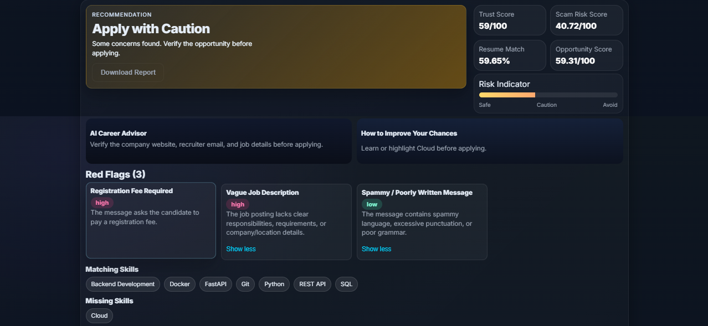
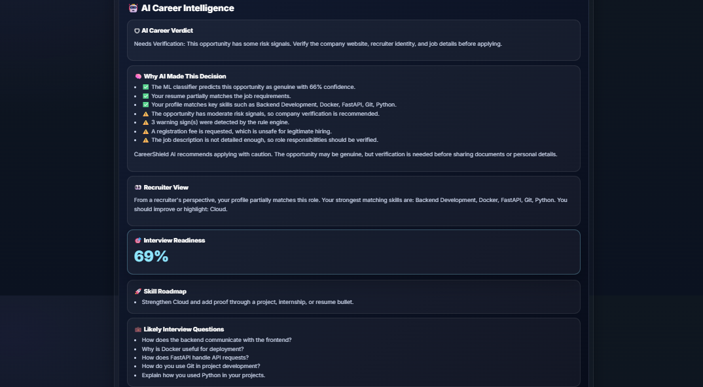

# 🛡️ CareerShield AI

<div align="center">

## **Know Before You Apply.**

AI-powered recruitment scam detection, resume analysis, and career intelligence platform built using **FastAPI**, **Machine Learning**, and **NLP**.


</div>

---

# 📸 Screenshots

## Home


---

## Analysis Dashboard



### Detailed AI Analysis



---

# 🚀 Overview

CareerShield AI helps students and job seekers evaluate job opportunities before applying.

The platform combines **Machine Learning**, **Rule-Based Scam Detection**, **Resume Matching**, and **Career Intelligence** to identify fraudulent opportunities and provide actionable career insights.

---

# ✨ Features

### 🛡️ Recruitment Scam Detection

* Detects registration fee scams
* Upfront payment requests
* Free email providers
* Unrealistic salary offers
* Work-from-home scam patterns
* Immediate joining pressure
* Missing company information
* Vague job descriptions

---

### 🤖 Hybrid Scam Analysis

Combines:

* Rule-Based Detection Engine
* TF-IDF Text Representation
* Machine Learning Classification

Outputs:

* Trust Score
* Scam Risk Score
* Scam Risk Level
* Final Recommendation

---

### 📄 Resume Intelligence

* Resume–Job Match Score
* Matching Skills
* Missing Skills
* Skill Gap Analysis

---

### 💼 AI Career Intelligence

Generates:

* AI Career Verdict
* Recruiter's Perspective
* Interview Readiness Score
* Personalized Skill Roadmap
* Likely Interview Questions

---

### 📊 Interactive Dashboard

Displays:

* Scam Analysis
* Resume Analysis
* Opportunity Score
* Career Insights
* AI Explanation
* Model Summary

---

# ⚙️ System Workflow

```text
                 Job Description
                        │
                        ▼
          Rule-Based Scam Detection
                        │
                        ▼
             Machine Learning Model
        (TF-IDF + Best Selected Classifier)
                        │
                        ▼
              Hybrid Scam Analysis
                        │
                        ▼
 Resume ─────────► Resume Matching
                        │
                        ▼
              Career Intelligence
                        │
         ├── Career Verdict
         ├── Recruiter's View
         ├── Skill Roadmap
         ├── Interview Questions
         └── Readiness Score
                        │
                        ▼
              Interactive Dashboard
```

---

# 🛠️ Tech Stack

| Category         | Technologies                                                                                         |
| ---------------- | ---------------------------------------------------------------------------------------------------- |
| Frontend         | HTML5, CSS3, JavaScript                                                                              |
| Backend          | Python, FastAPI, Uvicorn                                                                             |
| Machine Learning | Scikit-learn, TF-IDF, Logistic Regression, Linear SVM, Random Forest, Gradient Boosting, Naive Bayes |
| NLP              | TF-IDF, Skill Extraction                                                                             |
| Version Control  | Git, GitHub                                                                                          |

---

# 📂 Project Structure

```text
CareerShield-AI/

├── assets/
│
├── frontend/
│   ├── index.html
│   ├── style.css
│   └── script.js
│
├── backend/
│   ├── app/
│   │   ├── ml/
│   │   ├── services/
│   │   └── main.py
│   │
│   └── requirements.txt
│
├── README.md
└── .gitignore
```

---

# 🚀 Getting Started

### Clone Repository

```bash
git clone https://github.com/nishthagupta25/CareerShield-AI.git
cd CareerShield-AI
```

### Backend

```bash
cd backend

python -m venv venv

venv\Scripts\activate

pip install -r requirements.txt

uvicorn app.main:app --reload
```

Backend:

```
http://127.0.0.1:8000
```

Swagger Docs:

```
http://127.0.0.1:8000/docs
```

Open `frontend/index.html` using Live Server.

---

# 📡 API Endpoints

| Method | Endpoint           | Description              |
| ------ | ------------------ | ------------------------ |
| POST   | `/analyze-job`     | Scam Detection           |
| POST   | `/analyze-resume`  | Resume Matching          |
| POST   | `/generate-report` | Complete Career Analysis |
| GET    | `/health`          | Health Check             |

---

# 🔮 Future Improvements

* Resume PDF Parsing
* Company Verification
* LinkedIn Job Analysis
* Authentication
* User Dashboard
* Analysis History
* Cloud Deployment
* LLM-powered Career Coach

---

# 👩‍💻 Developer

**Nishtha Gupta**

---

<div align="center">

### ⭐ If you found this project useful, consider starring the repository.

**Know Before You Apply.**

</div>
